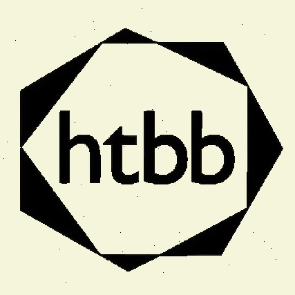

<p align="center">
  
</p>

<h1 align="center">HTBB Safeguarding Training</h1>

<p align="center">
  An interactive e-learning course covering how to recognise, respond to, and prevent abuse in church ministry.
</p>

<p align="center">
  <a href="https://andrewung2009.github.io/safeguarding-htbb/">Live Demo</a>
</p>

---

## About

A single-page application built for HTBB (Holy Trinity Bukit Bintang) to deliver mandatory safeguarding training to church staff and volunteers. The course walks learners through 7 modules of progressively deeper content — from foundational principles to practical scenarios and self-declaration.

**Key features:**

- Progressive block-by-block lesson flow (videos, quizzes, reflections, scenarios)
- Real-time progress tracking with localStorage persistence
- Module hub with animated progress rings
- 20 interactive quizzes with instant feedback
- Responsive design — works on desktop, tablet, and mobile
- Zero dependencies beyond Vite (no React, no frameworks)

## Course Content

| Module | Title | Lessons |
|--------|-------|---------|
| 1 | Introduction to Safeguarding | 1 |
| 2 | Safeguarding and the Gospel | 1 |
| 3 | The Scope of Safeguarding | 1 |
| 4 | What is Abuse? | 1 |
| 5 | How to Respond to Disclosure | 1 |
| 6 | Practical Safeguarding | 4 |
| 7 | Resources & Self-Declaration | 1 |

**10 lessons** total with **20 quizzes** across the course. Average completion time is approximately 30 minutes.

## Getting Started

### Prerequisites

- [Node.js](https://nodejs.org/) v18 or higher
- npm (included with Node)

### Installation

```bash
git clone https://github.com/andrewung2009/safeguarding-htbb.git
cd safeguarding-htbb
npm install
```

### Development

```bash
npm run dev
```

Opens at **http://localhost:3000** with hot module replacement.

### Production Build

```bash
npm run build      # outputs static files to dist/
npm run preview    # preview the production build locally
```

## Project Structure

```
.
├── index.html                  # Vite entry point — app shell (header, content, bottom nav)
├── src/
│   ├── main.js                 # Entry — imports CSS, calls init()
│   ├── app.js                  # All rendering, event listeners, and init logic
│   ├── state.js                # localStorage state management (view, progress, answers)
│   ├── course-data.js          # Entire course content as COURSE_DATA object
│   ├── icons.js                # 20 inline SVG icon strings
│   ├── utils.js                # Helpers: escHtml, arrEq, getYoutubeEmbedUrl
│   └── style.css               # Full stylesheet with CSS custom properties
├── public/
│   └── htbb-logo.png           # Logo asset (served at root)
├── .github/
│   └── workflows/
│       └── deploy.yml          # GitHub Actions — builds and deploys to GitHub Pages
├── vite.config.js              # Vite config (base path, port, output dirs)
├── package.json                # Dependencies and scripts
└── README.md
```

## Architecture

The app has two views:

**Hub View** — A module card grid where each card shows the module title, current lesson name, and an animated SVG progress ring. Clicking a card enters the first lesson of that module.

**Lesson View** — A progressive block-by-block flow. Each lesson is broken into blocks (video, text, quiz, discussion, scenario, etc.) that are shown one at a time. The user clicks "Next Step" to advance. Quizzes and discussions must be completed before advancing.

```
Hub View                     Lesson View
┌──────────────────┐        ┌──────────────────┐
│  Module Cards     │   ──►  │  [Block: Video]   │
│  with progress    │        │  [Block: Quiz]    │
│  rings            │        │  [Block: Text]    │
│                   │        │  [Block: Discuss] │
│  Click to enter   │        │  [Complete!]      │
└──────────────────┘        └──────────────────┘
```

**State management** uses a single `localStorage` key (`htbb-safeguarding-state`) storing:

```js
{
  view: "hub" | "lesson",
  currentLessonId: string,
  currentBlockIndex: number,
  quizAnswers: { [blockId]: { answers: [], submitted: bool } },
  discussionTexts: { [blockId]: string },
  expandedModules: { [moduleId]: bool },
  declarationChecks: { [key]: bool }
}
```

**Module dependency flow:**

```
main.js → app.js → icons.js, utils.js, state.js, course-data.js
```

## Editing Course Content

All course content lives in `src/course-data.js` as a single `COURSE_DATA` object. Each module has lessons, and each lesson has a `blocks` array.

### Block Types

| Type | Description |
|------|-------------|
| `video` | Embedded YouTube video (requires `url` and `title`) |
| `text` | Rich text content (requires `content` with HTML) |
| `quiz` | Multiple-choice question (requires `question`, `options`, `correctIndex`) |
| `discussion` | Open reflection prompt (requires `prompt`) |
| `scenario` | Real-world situation for discussion (requires `situation`, `questions`) |
| `principles` | Key principles list (requires `items` array) |
| `officers` | Safeguarding officer info (requires `roles` array) |
| `links` | External resource links (requires `links` array) |
| `warning` | Important notice callout (requires `content`) |
| `safer-recruitment` | Recruitment policy info (requires `content`) |
| `declaration` | Self-declaration form (links to Microsoft Forms) |
| `closing` | Lesson summary (requires `content`) |

### Adding a Lesson

In `src/course-data.js`, add a lesson object to the appropriate module:

```js
{
  id: "lesson-new-topic",
  title: "New Topic",
  blocks: [
    { type: "video", id: "vid-new", url: "https://youtube.com/...", title: "Video Title" },
    { type: "quiz", id: "quiz-new", question: "What did you learn?", options: ["A", "B", "C"], correctIndex: 0 },
    { type: "text", id: "text-new", content: "<p>Key takeaways...</p>" }
  ]
}
```

## Tech Stack

- **HTML / CSS / JavaScript** — vanilla, no framework
- **Vite** — dev server, build tooling, module bundling
- **GitHub Actions** — CI/CD pipeline for GitHub Pages deployment
- **localStorage** — client-side progress persistence

## Deployment

The site deploys to GitHub Pages automatically on every push to `main` via GitHub Actions. The workflow:

1. Checks out the repo
2. Installs dependencies (`npm ci`)
3. Builds static files (`npm run build`)
4. Deploys `dist/` to the `gh-pages` branch using [peaceiris/actions-gh-pages](https://github.com/peaceiris/actions-gh-pages)

GitHub Pages is configured to serve from the `gh-pages` branch.

## License

This project is private to HTBB (Holy Trinity Bukit Bintang).
